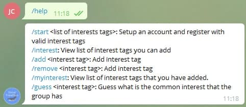
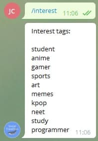
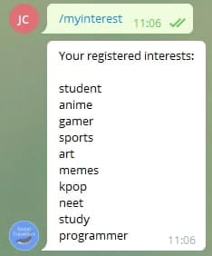
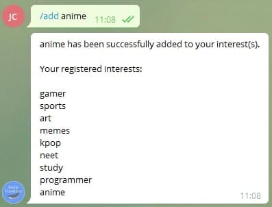
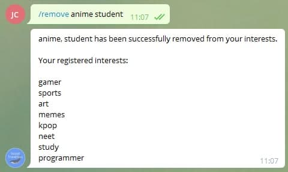

# SocialTravellers - Created by HackersUnited(014)

## Contents
1. [Problem statement](#problem-statement)
1. [Short description](#short-description)
1. [Features](#features)
1. [Built with](#built-with)

## problem-statement
Our team HackersUnited(014) have chosen the following probelm statement:

Social
In a post-COVID-19 world where face-to-face interaction is no longer the main mode of
communication, how would you revolutionize making new and/or maintaining relationships?

## Short description

### What's the problem?
COVID-19 have had it hard for us to communicate with the others despite having many social media platforms such as Instagram, facebook and Twitter. For instance, a survey conducted and lead by Horigian on 1008 people aged 18-35 reported that 80% of the participants faced some form of depression during the pandemic.  Therefore, there is a need for us to find new innovative ways to revolutionize communication.

### How can our solution help?
SocialTravellers is a python telegram bot which aims to encourage communication among people of similar interest. It uses simple chat features and gamification gamified to promote chatting over the internet which can form new relationships and also maintain them. SocialTraveller will match users with similar interests into group of five. Each group would last for a day and user will be removed from the group. The users will then be invited into new group to meet new people everyday.

## Features

### Start

Starts the bot and add the user chat id and the valid interest tags into the individual database sqlite.

### help

Help command displays all the valid commands of SocialTravellers bot.

### interest

Interest command provide a list of available interests that user can add. This interest tag is used for matching with other users who have the same interest.

### myinterest

Myinterest command allows users to view their registered interests. They can decide to add or remove the registered interests using the add or remove commands.

### add

Add command allows user to add additional interest he/she may has. This allows user to explore different interests and communicate with people of different interests.

### remove

Remove command allows user to remove interest he/she may no longer have.

### guess

Guess command: Take a guess as to what is the common interest within the group.

## Built with
Python Telegram Library & Visual Studio Code